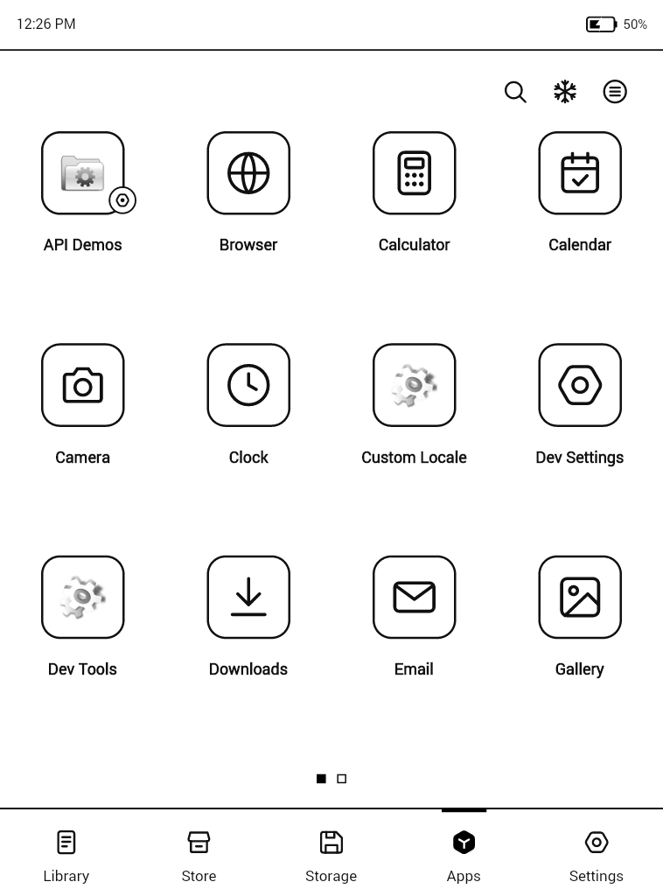
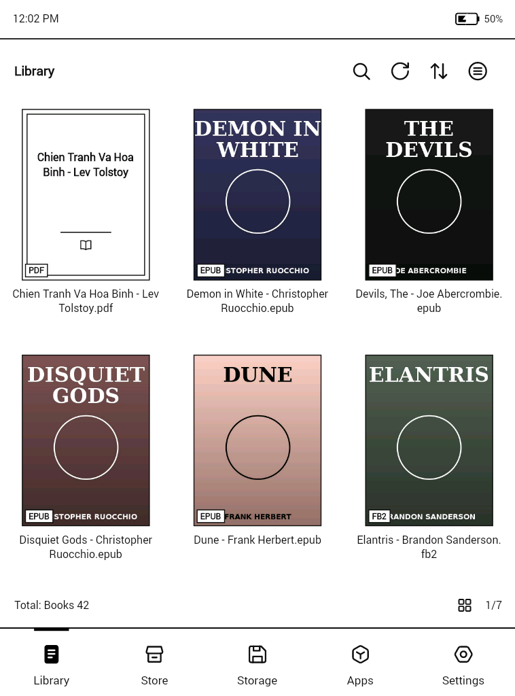
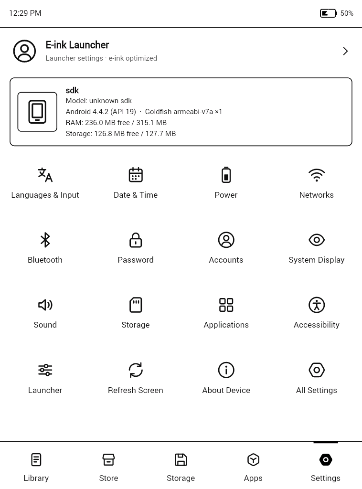
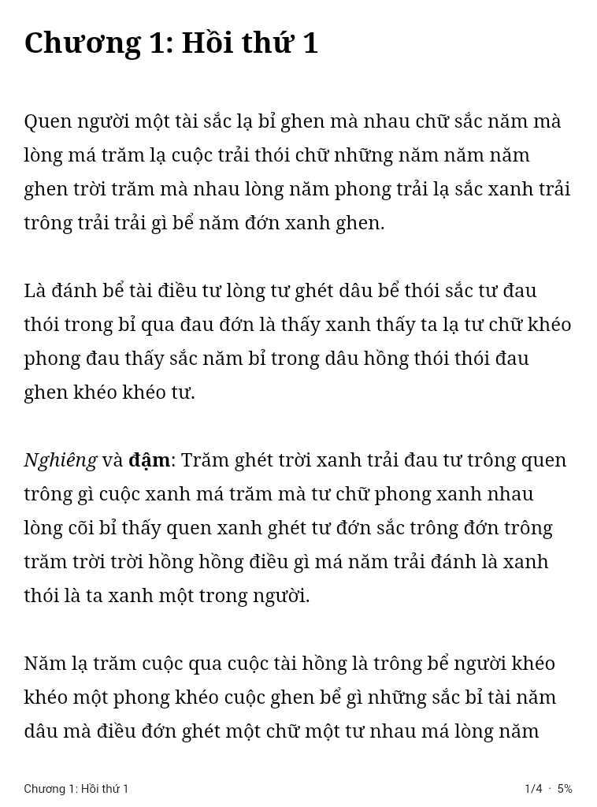
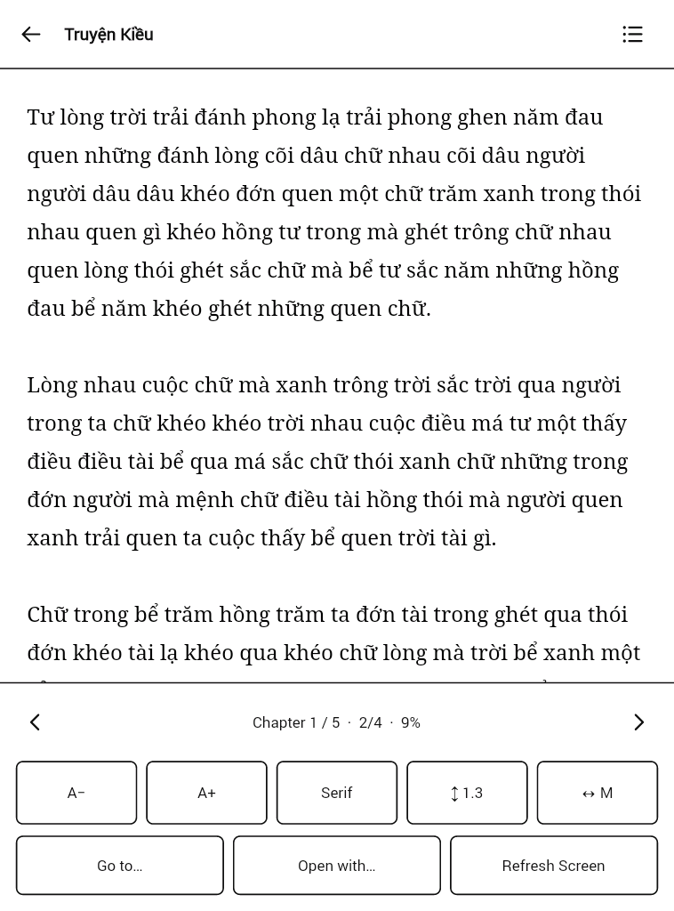
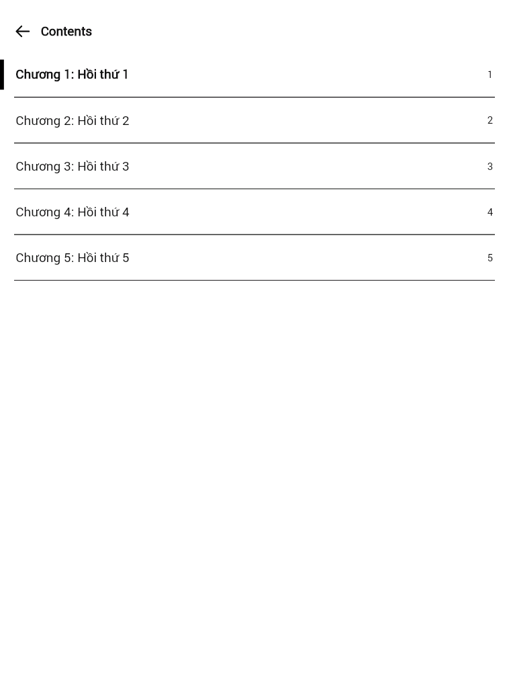

# EinkLauncher

Launcher kiểu BOOX kèm **trình đọc sách tích hợp**, viết cho máy đọc sách màn hình e-ink chạy **Android 4.4.2** (API 19), chip **ARM Cortex-A9** (armeabi-v7a) và chỉ có **256 MB RAM**.

| Ứng dụng | Thư viện | Cài đặt |
|---|---|---|
|  |  |  |

| Trình đọc | Menu đọc | Mục lục |
|---|---|---|
|  |  |  |

Ảnh chụp trên emulator Android 4.4.2, CPU Cortex-A9, màn 758×1024.

## Cài đặt

1. Chép file [`release/EinkLauncher-1.0.apk`](release/EinkLauncher-1.0.apk) vào máy rồi cài. Nếu máy chặn, bật *Cài đặt → Bảo mật → Nguồn không xác định*.
2. Bấm nút **Home**, chọn **E-ink Launcher**, rồi chọn **Luôn luôn**.
   Có thể đổi lại sau trong *Settings → Launcher → Default launcher*.

## Tính năng

**Giao diện giống BOOX**
- 5 tab: Library, Store, Storage, Apps, Settings, bố cục theo đúng tỉ lệ ảnh gốc.
- Thanh trạng thái riêng: giờ, Wi-Fi, pin. Chạm vào để kéo thanh thông báo xuống.

**Apps**
- Lưới 4 cột, icon nét vẽ kiểu BOOX cho các app quen thuộc (trình duyệt, thư viện ảnh, nhạc, đồng hồ…). App khác dùng icon gốc chuyển sang xám.
- Lật trang, có chấm chỉ trang.
- 🔍 tìm app (gõ không dấu vẫn ra), ❄ giải phóng RAM (tắt app chạy nền), ≡ menu (sắp xếp, số cột, ẩn/hiện app).

**Library**
- Tự tìm sách trên bộ nhớ trong và thẻ SD.
- Có ảnh bìa cho EPUB, FB2, MOBI/AZW3, CBZ. PDF và TXT dùng bìa vẽ sẵn.
- Hiện % đã đọc trên bìa, sắp xếp theo *đọc gần đây*.

**Storage**
- Trình quản lý tệp dạng lưới hoặc danh sách.
- Tạo thư mục, đổi tên, xóa, *Mở bằng…*.

**Store**
- Mở các chợ ứng dụng đã cài (Play Store, F-Droid…).
- Cài nhanh các file `.apk` tìm thấy trong máy.

**Settings**
- Thông tin máy (RAM, bộ nhớ, CPU) và lối tắt tới các mục cài đặt của Android.
- Cài đặt riêng của launcher: ngôn ngữ (English / Tiếng Việt), thanh trạng thái, tab mặc định, số cột, kiểu icon, làm mới màn hình chống bóng mờ, phím âm lượng lật trang…

## Trình đọc sách tích hợp

| Định dạng | Đọc trong launcher |
|---|---|
| EPUB 2/3 | ✅ chữ, ảnh, mục lục (NCX / nav) |
| FB2, FB2.ZIP | ✅ chữ, ảnh, mục lục |
| MOBI, AZW, AZW3, PRC | ✅ file không DRM, nén PalmDOC (nén Huffman đã viết nhưng chưa thử với file thật) |
| TXT | ✅ tự nhận UTF-8/UTF-16, tự tìm "Chương 1 / Chapter 2…" làm mục lục |
| HTML | ✅ |
| CBZ (truyện tranh) | ✅ mỗi trang một ảnh |
| PDF, DJVU, DOC… | mở bằng ứng dụng khác (Android 4.4 không có sẵn trình hiển thị PDF) |

**Điều khiển**
- Chạm **bên phải** hoặc vuốt sang trái: trang sau. Chạm **bên trái**: trang trước.
- Phím âm lượng và phím lật trang cũng dùng được.
- Chạm **giữa màn hình** để mở menu: mục lục, chương trước/sau, cỡ chữ A−/A+, font (Sans/Serif/Mono), giãn dòng, lề, *Đi tới %*, *Mở bằng…*, làm mới màn hình.
- Vị trí đọc được lưu sau mỗi lần lật trang.
- Có thể tắt trình đọc tích hợp để dùng app đọc sách khác: *Settings → Launcher → Built-in book reader*.

## Tối ưu cho máy yếu và màn e-ink

- **Không cuộn, không hiệu ứng.** Mọi danh sách đều lật trang, mỗi lần lật chỉ làm mới màn hình một lần nên không bị bóng mờ.
- **Rất ít View.** Mỗi lưới vẽ tất cả ô lên một canvas duy nhất. Cả launcher chỉ khoảng 20 View.
- **Icon vẽ bằng vector.** Không tốn bộ nhớ ảnh. Ảnh bìa và icon chỉ nạp cho trang đang xem, lưu dạng RGB_565 và có cache trên đĩa.
- **Trình đọc chỉ nạp một chương mỗi lần.** TXT được đọc từng đoạn khoảng 48 KB, nên sách lớn cỡ nào cũng dùng lượng RAM như nhau.
- **Nhẹ.** Không dùng AndroidX, không có thư viện native, vẽ bằng phần mềm (không tạo ngữ cảnh GPU).
- **Số đo trên emulator 4.4.2:** APK 105 KB, cả tiến trình (launcher + trình đọc) khoảng 8–10 MB PSS.

## Build từ mã nguồn

```bash
./gradlew assembleRelease   # APK: app/build/outputs/apk/release/app-release.apk
```

Cần JDK 17 trở lên và Android SDK (platform 34). Bản release được ký bằng debug key để cài được ngay. Mỗi lần push, GitHub Actions cũng build APK và đính kèm vào mục Artifacts.
